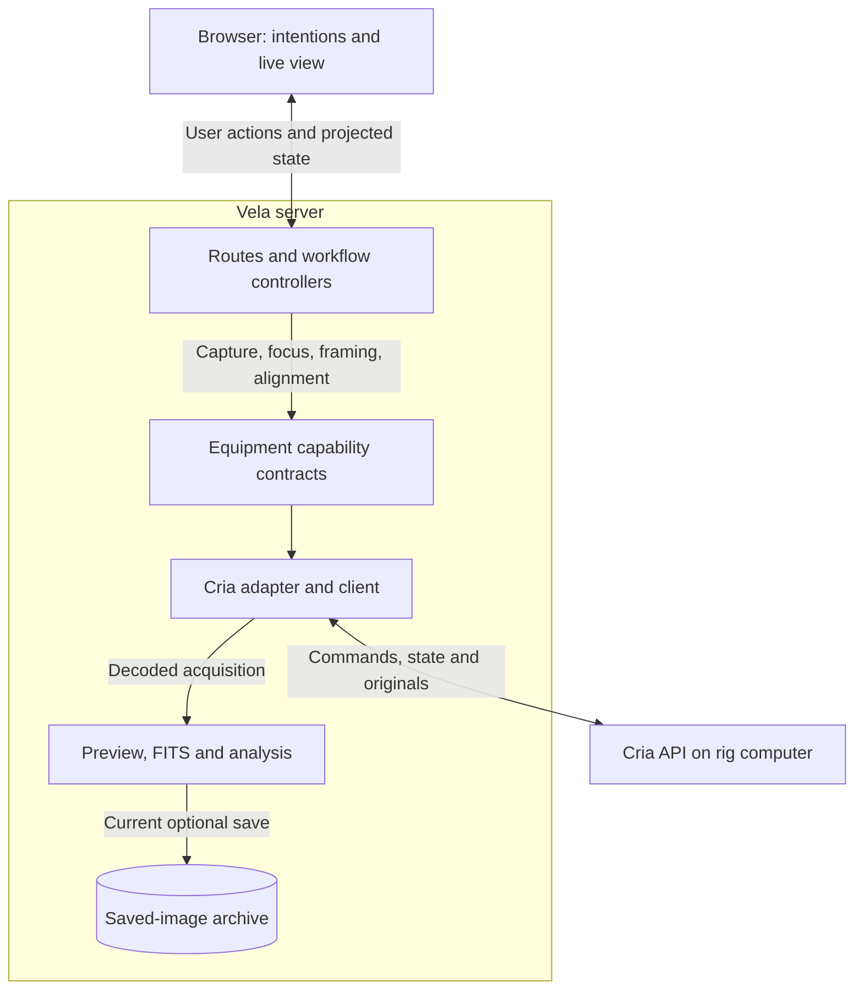

# Vela's application design

[Architecture index](README.md) · **Current structure with unfinished requirements identified.**

## Purpose before components

Vela turns Observer's intention into useful observing work. It chooses what to prepare, capture, analyze and do next. Cria performs bounded equipment operations close to the rig, so Vela does not coordinate each driver property over Wi-Fi. Vela's capable host performs image processing; the browser presents the situation and sends user intentions.

For example, a focus workflow chooses a focuser position, requests a move, requests an exposure and measures the returned image. Cria validates/executes those individual physical operations. Vela judges focus quality. A poor image does not imply that restarting the camera would help, and it does not remove the preservation obligation.

## Current boundaries

**Legend:** enclosing box is the Vela server process boundary; arrows summarize dependencies/data, not every function call. The cylinder is durable storage. This diagram describes **current composition**. It does not show an implemented preserve-all archive coordinator or durable session continuation; those are proposed additions.

| Component | Purpose and current evidence |
| --- | --- |
| Browser and model | View/state contracts and user intentions; does not receive Cria credentials |
| Server composition | Chooses an explicit rig adapter; a Cria rig does not silently fall back to Alpaca. [Composition](../../apps/server/src/equipment/composition.ts#L38) |
| `@vela/equipment` | Narrow acquisition/pointing/control capabilities used by workflows. [Frame and acquisition contract](../../packages/equipment/src/acquisition.ts#L7) |
| `@vela/cria` | Validates Cria wire data, pins identities, reconciles lost responses and shares state delivery. [Client](../../packages/cria/src/client.ts#L115), [events](../../packages/cria/src/events.ts#L111) |
| `apps/server/src/cria` | Maps Cria facts and commands to normalized equipment capabilities. [Adapter](../../apps/server/src/cria/equipment.ts) |
| Workflow controllers | Own intent, progress and scientific choices. [Capture](../../apps/server/src/capture/controller.ts#L51), [autofocus](../../apps/server/src/autofocus/controller.ts#L120), [alignment](../../apps/server/src/alignment/controller.ts#L295) |
| Imaging and archive | Generate previews/FITS, analyze samples and publish saved artifacts. [FITS](../../apps/server/src/imaging/fits.ts), [archive store](../../apps/server/src/saved-images/store.ts#L156) |

Keep these boundaries concrete. A shared acquisition-result mechanism should preserve all consumers' results without making each controller implement the Cria transport or archival receipt protocol. The low-level client handles validated transport; Vela's application/storage boundary owns archive policy. Its exact new interfaces remain proposed.

## State, progress and interrupted communication

Current Cria state is shared rather than individually polled by each browser widget. Vela validates timing using receipt/elapsed information and rejects invalid stream progress; it does not assume the two computers' wall clocks agree. Heartbeats are transport evidence only. Required field ages and identities must still be checked before workflow decisions.

An operation missing from the recent snapshot is looked up explicitly; SSE is not a durable event log. Within a running Vela process, admission reconciliation keeps the exact request body and transfers retry the same original. An API incarnation/binding change currently sets a persistent write-failure in that client; useful in-place revalidation remains unfinished. [Client admission](../../packages/cria/src/client.ts#L425), [identity pinning](../../packages/cria/src/client.ts#L182).

An interrupted image read should preserve useful workflow context and clearly show that observation is interrupted. Unknown physical outcomes block affected/dependent work. They do not justify repeated commands or resetting healthy hardware. Independent read/archive/analysis work can continue where it does not depend on the unresolved outcome.

## Current image and session limitations

**Original custody:** the [Cria adapter](../../apps/server/src/cria/equipment.ts) no longer releases after decoding. It records acquisition intent before sending each capture request, then attempts to preserve the exact original and a complete context manifest in the [acquisition archive](../../apps/server/src/acquisitions/README.md), verifies them against the expected acquisition, and sends Cria a receipt before returning the frame. If that attempt fails, the frame is still returned and preservation is pending until recovery archives the same original. Recovery finishes interrupted receipts and archives originals Cria still retains, but skips requests an active acquisition owns. The capture controller still creates preview/FITS data, keeps three recent images in memory and saves to the gallery only when requested. Keep remains a gallery choice, not the preservation trigger. Archive-health visibility is not yet implemented.

The normalized `Frame` still omits source identities; they are recorded in the archive manifest rather than carried through scientific controllers, and the gallery creates its own Vela image ID. Request maps and capture runs are memory-resident. Durable Cria admission alone cannot reconstruct Vela's goals or archive obligations after Vela restarts. The [session/archive design](session-and-archive.md) introduces the minimum required durable facts without persisting every live reading or solver step.

## Concurrency and failure scope

The current [rig operation lane](../../apps/server/src/rig/operations.ts#L1) conservatively prevents conflicting workflows. Keep this simplicity until an observing need justifies more concurrent physical work. Background transfer and processing are different from issuing simultaneous device commands.

A browser disconnect, Vela restart, Cria API restart, worker failure and host reboot are separate recovery cases. The first can leave the server's workflow running; the second loses current Vela memory; the others may leave unresolved physical work. A general “reconnect” label must not erase those differences.

Vela's product remains for Chris's current observatory/local network. No multi-user cloud control plane or generic extension framework is required by these recovery contracts. Environmental warnings may inform Observer; no weather/rain protection or disconnected-weather fallback is installed or implied.
