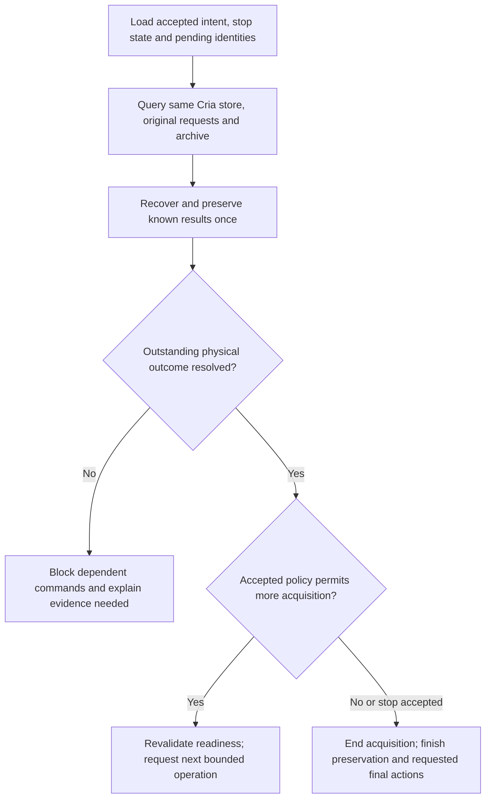

# Session continuity and archive design

[Architecture index](README.md) · **Proposed implementation boundaries for approved responsibilities.** D1/D2 remain open; no format or final equipment state is selected by this page.

The shared [Cria contract](https://github.com/chrhicks/cria/blob/docs/architecture-baseline-20261008/docs/architecture/contracts.md) owns command identity, uncertainty, result discovery and verified release. This page describes how Vela should fulfill its side.

## Minimal session record

Vela needs enough durable information to know what Observer asked for and reconcile what it already sent. It does not need a general editable sequence engine.

| Durable fact | Why it is needed |
| --- | --- |
| Stable session/start identity | A lost browser response must not create a second logical run |
| Accepted intent, parameters and limits | Restart must not invent a new goal or reset the observing window |
| Pinned Cria store and exact pending request | Find the original operation after response loss; keep original instance/binding IDs |
| Known operation/result/source identities | Associate acquired data and count progress once |
| Archive obligation and verified receipt | Recover saved-but-unacknowledged work and finish the same transfer |
| Accepted stop/pause intent | Restart must not resume after an acknowledged stop |
| Attempt/budget accounting | Failure/restart must not grant an unlimited fresh retry budget |

Record pending intent before sending equipment work. A single active writer owns the session; a second local Vela process must not continue it concurrently. This is an application ownership requirement, not a need for a distributed scheduler. Persist evidence sufficient to reconstruct counters from unique outcomes rather than requiring every UI update to be durable.

**Current state:** each capture's acquisition intent (rig, device, purpose, exposure and the exact Cria request ID) is recorded durably before the request is sent; see the [acquisition archive](../../apps/server/src/acquisitions/README.md). That covers archive obligations only. Session intent, stop state, limits and capture runs are still memory-only; their storage model remains design work.

## Restart reconciliation

**Legend/status:** proposed decision flow; diamonds require evidence/policy, not elapsed waiting. “Finish final actions” applies only to actions actually requested under a chosen policy and supported by the rig. Unknown outcome blocking does not prevent independent verified-image recovery.

Accept these boundaries before claiming restart continuity:

- A lost admission response is reconciled with the exact old request. Do not replace IDs, retarget a new binding or infer non-execution from an expired/regressed ledger.
- Persist stop before acknowledging it to the browser. An already completed capture is preserved even if it wins the cancellation race; no next exposure follows an accepted stop.
- Rediscover an already saved source image and count it once after a lost progress update. Keep does not need to be pressed again.
- Do not restart a fresh duration after downtime. D2 must define wall-clock/integration/frame-count meaning and permitted continuation. Reconciliation/transfer can continue after new acquisition has ended.
- Revalidate operational state and dependent workflow assumptions. Recovering an alignment frame does not prove the interrupted alignment computation remains valid.
- Give each requested final hardware action a stable identity too. Acquisition ended, archive complete and equipment end state confirmed are separate facts.

Cria API/worker failure is a separate case from Vela-only restart. A verified result may become recoverable while equipment remains blocked. The client's `download()` still requires a succeeded, settled operation for the active consumer. Results of other operations are recovered through Cria custody (`custody()`, `originalOf()`) by the acquisition archive's recovery, which leaves the command interlock in place; see the [Cria client](../../packages/cria/README.md).

## Archive boundary for every consumer

The preservation path must sit where all real acquisitions pass through it: Capture, autofocus, target framing and alignment. Caller context identifies why an image was acquired; quality/preview success is not a prerequisite for storage.

The current [saved-image store](../../apps/server/src/saved-images/store.ts#L156) is a useful foundation: write/sync staging files, publish the directory and sync its parent. Its deduplication by Vela frame ID and metadata/file-existence checks do not yet prove matching Cria source identity or archive verification. The `Frame` still lacks source identities; the acquisition archive records them, and `download()` now also returns the exact original bytes for preservation.

Proposed responsibilities:

1. Carry stable acquisition lineage and required context through the capability boundary. Exact interfaces remain to be designed; the scientific controller should not import Cria wire internals.
2. Publish the chosen archival artifact and an immutable versioned context manifest durably. Preserve unavailable facts explicitly. Later analysis is supplemental, not mutation of previously acknowledged context.
3. Verify the stored artifact and context against the source. Persist an archive receipt before asking Cria to release its copy.
4. Reconcile duplicate/lost acknowledgement against the same source and receipt. A saved artifact without a receipt is rediscovered and verified; another exposure is never the repair.
5. Keep archive failure separate from preview/analysis failure. A poor image remains preserved, with its assessment attached.

The full receipt contents, order and failure matrix are authoritative in [shared custody](https://github.com/chrhicks/cria/blob/docs/architecture-baseline-20261008/docs/architecture/contracts.md#originals-and-archive-custody). Storage forecasting belongs to Vela for its destination and Cria for its local disk. If destination storage is unavailable, retain the same original at Cria and pause acquisition when bounded capacity demands it. Today that pause is Cria's own capacity refusal; Vela's [archive health](../../apps/server/src/acquisitions/README.md#health-and-forecast) reports it and adds no earlier threshold. No unselected-frame or temporary-archive expiry is authorized.

## Canonical representation

**Open D1:** exact ImageBytes plus context versus verified lossless FITS plus context. ImageBytes is Cria's serialization of ASCOM pixels, not an assurance of extra sensor metadata. The current [FITS encoder](../../apps/server/src/imaging/fits.ts#L6) preserves supported integer samples using unsigned-16-equivalent or signed-32 storage, but its selected headers do not contain the complete acquisition context and can sanitize/shorten text.

Exact-byte retention simplifies source digest matching and preserves the captured serialization, but retaining FITS as well costs storage. FITS-only can avoid that duplicate if an explicit equivalence contract preserves samples, dimensions/orientation, color, signedness/scaling and all required context. Verify equivalence before release and preserve source/artifact digests and verification provenance; a FITS checksum alone is insufficient. Unknown future metadata cannot be assumed preserved by today's encoder.

Exact bytes remain the reviewer's conservative initial recommendation, **not Chris's selection**. Both choices satisfy preserve-all only with proper context and verification. Source identity and custody must work regardless of the eventual format choice.

## Keep and session ending

Keep can select favorites or gallery entries. The exact UI is D3; preserve-all is already approved. A quieter gallery must not imply that unselected originals are disposable. Any later destructive archive cleanup needs Observer retention policy.

D2 also governs ending a session. Vela stops issuing new work, reconciles active operations, preserves results and requests the chosen supported final actions. This page does not select park, warming, tracking-off, disconnect or power-off, nor their order. Cria reports the actual action outcomes; release alone does not establish those states.

The smallest useful improvement is this durable intent/result/archive chain. It does not require persistent solver internals, automatic resumption of every workflow, cloud backups or a universal observing language.
